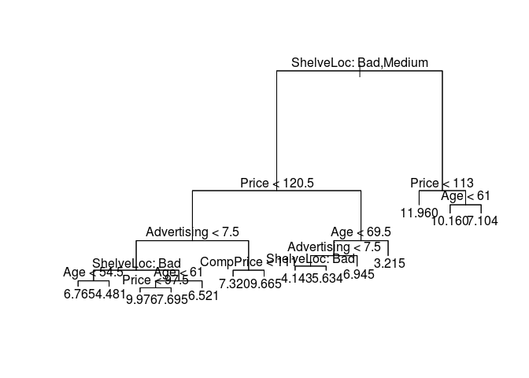
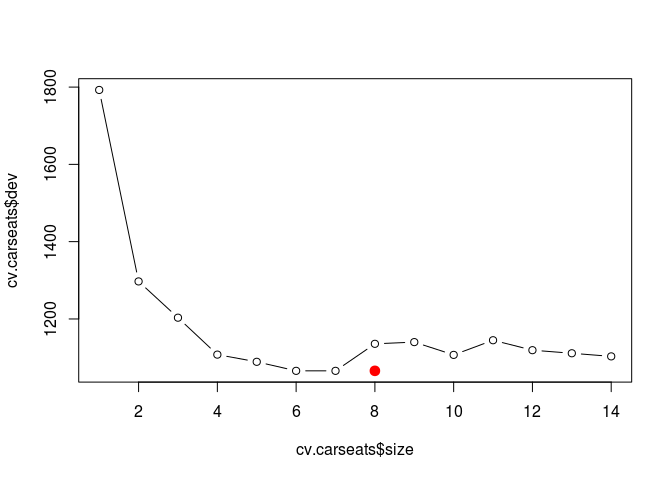
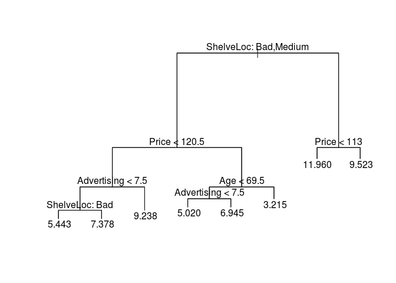

Untitled
================
Mustafa Kammar
3/5/2019

1.  This question refers to Chapter 9 Problem 8 beginning on page 371 in the text.

    1.  Create a training sample that has roughly 80% of the observations. Use `set.seed(19823)`.

``` r
library(ISLR)
set.seed(19823)
train <- sample(1:nrow(Carseats), nrow(Carseats) / 2)
Carseats.train <- Carseats[train, ]
Carseats.test <- Carseats[-train, ]
```

    b. Use the `kernlab` package to fit a support vector classifier to the 

training data using `C = 0.01`.

``` r
library(tree)
tree.carseats <- tree(Sales ~ ., data = Carseats.train)
summary(tree.carseats)
```

    ## 
    ## Regression tree:
    ## tree(formula = Sales ~ ., data = Carseats.train)
    ## Variables actually used in tree construction:
    ## [1] "ShelveLoc"   "Price"       "Advertising" "Age"         "CompPrice"  
    ## Number of terminal nodes:  14 
    ## Residual mean deviance:  2.702 = 502.6 / 186 
    ## Distribution of residuals:
    ##     Min.  1st Qu.   Median     Mean  3rd Qu.     Max. 
    ## -3.81500 -1.08200  0.03684  0.00000  1.01100  3.81700

``` r
plot(tree.carseats)
text(tree.carseats, pretty = 0)
```



``` r
yhat <- predict(tree.carseats, newdata = Carseats.test)
mean((yhat - Carseats.test$Sales)^2)
```

    ## [1] 5.327926

    c. Compute the confusion matrix for the training data. Report the overall 

error rates, sensitivity, and specificity.

``` r
cv.carseats <- cv.tree(tree.carseats)
plot(cv.carseats$size, cv.carseats$dev, type = "b")
tree.min <- which.min(cv.carseats$dev)
points(tree.min, cv.carseats$dev[tree.min], col = "red", cex = 2, pch = 20)
```



``` r
prune.carseats <- prune.tree(tree.carseats, best = 8)
plot(prune.carseats)
text(prune.carseats, pretty = 0)
```



``` r
yhat <- predict(prune.carseats, newdata = Carseats.test)
mean((yhat - Carseats.test$Sales)^2)
```

    ## [1] 5.719914

    d. Construct the ROC curve. 

``` r
library(MASS)
library(randomForest)
```

    ## randomForest 4.6-14

    ## Type rfNews() to see new features/changes/bug fixes.

``` r
bag.carseats <- randomForest(Sales ~ ., data = Carseats.train, mtry = 10, ntree = 500, importance = TRUE)
yhat.bag <- predict(bag.carseats, newdata = Carseats.test)
mean((yhat.bag - Carseats.test$Sales)^2)
```

    ## [1] 2.90411

    e. Use the `train` function from the `caret` package to find an optimal cost

parameter (`C`) in the range 0.01 to 10. Use `seq(0.01, 10, len = 20)`.

    f. Compute the training and test classification error.


    g. Repeat (b) - (d) using an SVM with a polynomial kernel with degree 2. 


    h. Which method would you choose?


    i. Repeat (b) - (d) using an SVM with a radial basis kernel. Train it. 
    j. Using the best models from LDA, SVC, SVM (poly), and SVM (radial), 
    compute the test error. 
    k. Which method would you choose?

1.  Train one of the SVM models using a single core, 2 cores, and 4 cores. Compare the speedup (if any).
2.  You might want to look at `rbenchmark` or `microbenchmark` packages for timing.
